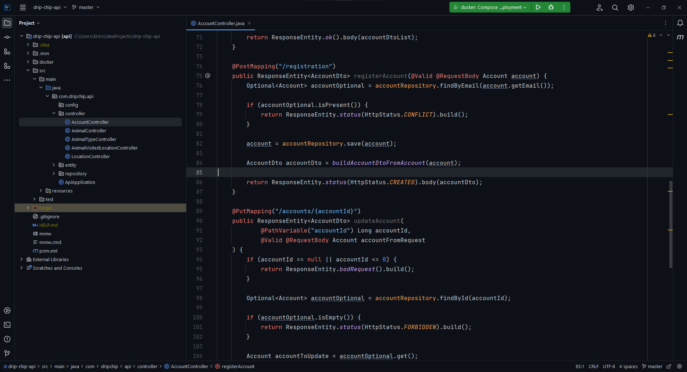

# CatHub Theme

---

## Overview

<!-- Plugin description -->

This theme is my own interpretation of how a GitHub theme should look.  
It's a mix of one of the [Gerry Themes](https://plugins.jetbrains.com/plugin/18922-gerry-themes) and GitHub colors that I like the most.

Important notes about CatHub Theme:
 - It's very dark and therefore high contrast
 - Mainly focusing on styling new Intellij IDEA UI
 - May contain various bugs, because initially was made for personal use

<!-- Plugin description end -->

### Changes made to the original Gerry Themes

In particular to the `gerryDark.theme.json` file inside of [this repository](https://github.com/gerryhjs/gerry-themes)

- Changed the color pallet
- Changed the checkboxes styling
- Changed the buttons styling
- Changed the run widget styling

## Installation

- Using IDE built-in plugin system:
  
  <kbd>Settings/Preferences</kbd> > <kbd>Plugins</kbd> > <kbd>Marketplace</kbd> > <kbd>Search for "CatHub Theme"</kbd> >
  <kbd>Install Plugin</kbd>
  
- Manually:

  Download the [latest release](https://github.com/krios2146/intellij-theme-github/releases/latest) and install it manually using
  <kbd>Settings/Preferences</kbd> > <kbd>Plugins</kbd> > <kbd>⚙️</kbd> > <kbd>Install plugin from disk...</kbd>

---
Plugin based on the [IntelliJ Platform Plugin Template][template].

[template]: https://github.com/JetBrains/intellij-platform-plugin-template
